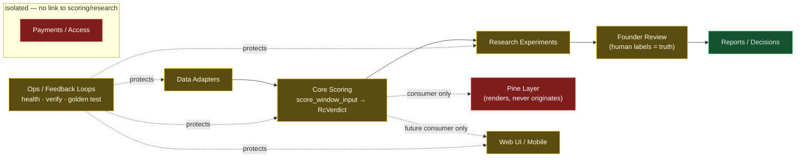

# RangeClarity System Map (living model)

> **Documentation / architecture only.** No behavior/scoring/caps/`agree3`/Pine/payment change; no
> commit/push. The living top-level model of the whole project. _As of 2026-06-25._ Daily view:
> [command-center](../ops/rangeclarity-command-center.md) · status: [module-status-board](./module-status-board.md)
> · boundaries: [module-registry](./module-registry.md) · audit + vocabulary:
> [rangeclarity-deep-modules](./rangeclarity-deep-modules.md) · workflow: [daily-workflow](../ops/daily-workflow.md).

## North Star
**Simple chart. Complex engine. No signals, no noise — just structure. Clarity over noise.**
The product sold is the TradingView **Pine indicator** (invite-only); the Next.js app is marketing + access only.
Daily question: *does this move RangeClarity closer to its first paying beta users **without increasing false confidence**?*

## Flow diagram

**One-way pipeline:** Data Adapters → Core Scoring → Research Experiments → Founder Review → Reports.
Pine and Web are **consumers** of a verdict (never producers). Ops wraps and protects everything.
Payments / Access is **isolated** from scoring and research.

## The nine modules
| # | Module | Boring interface | Status | Doc |
|---|---|---|---|---|
| 1 | **Core Scoring** | `score_window_input(RcWindowInput) -> RcVerdict` | 🟡 | [core-scoring](./modules/core-scoring.md) |
| 2 | **Data Adapters** | `loadCandles(symbol, source, range) -> NormalizedCandles` | 🟡 | [data-adapters](./modules/data-adapters.md) |
| 3 | **Research Experiments** | `runExperiment(config) -> ExperimentReport` | 🟡 | [research-experiments](./modules/research-experiments.md) |
| 4 | **Founder Review** | `loadFounderLabels()` · `compareAgentToFounder(labels)` | 🟡 | [founder-review](./modules/founder-review.md) |
| 5 | **Web UI / Mobile** | `displayVerdict(verdict)` + marketing pages | 🟡 | [web-ui](./modules/web-ui.md) |
| 6 | **Pine Layer** | (consumer — renders a verdict, no API) | 🔴 | [pine-layer](./modules/pine-layer.md) |
| 7 | **Ops / Feedback Loops** | `npm run health` (fast) · `npm run verify` (full) | 🟡 | [ops-feedback-loops](./modules/ops-feedback-loops.md) |
| 8 | **Payments / Access** | `lib/payments/index.ts` provider selector | 🔴 | [payments-access](./modules/payments-access.md) |
| 9 | **Product / Docs / PRD** | `CLAUDE.md` · `AGENTS.md` · `docs/**` · `.claude/commands/*` | 🟢 | [agent-map](../agents/agent-map.md) |

## Source of truth (resolve conflicts top-down)
1. Founder-approved decisions — `docs/decisions.md` (Approved) + the [decision-log](../ops/decision-log.md) mirror.
2. `docs/kanban.md` — the working board.
3. `docs/decisions.md` — the decision log.
4. Current repository state (git, files, build output).
5. Linear — only after an approved write-sync (Stage A today: **no Linear writes**).

The **scoring truth** is the Python core (`rc1_ultimate_offline_indicator`); the frozen **1,767-window Real
Baseline v1** is the measuring stick. Pine and Web must mirror that verdict, never redefine it.

## Consumers (who reads a verdict, never writes one)
- **Pine Layer** — renders a verdict on TradingView. **Consumer only**, today frozen.
- **Web UI / Mobile** — *future* consumer via `displayVerdict(verdict)`; currently marketing + access only.
- **Reports / Founder Review** — consume scored windows for human labeling and decisions.

## Blocked flows
- **Core Scoring → Pine:** blocked — Pine ships only at **GREEN** conviction.
- **Research → Broken-Zone A/B:** blocked until **≥20 founder labels** (now 15/40) + a frozen-baseline comparison.
- **Any scoring/cap/`agree3`/Broken-Zone behavior change:** blocked without a before/after baseline report.
- **Payments / Access changes:** blocked unless explicitly requested (isolated module).
- **Broad refactors / package merge:** blocked; only small, golden-tested steps.

## Risk areas
- **Core Scoring (HIGH):** the product *is* this verdict; any change risks **false confidence**. Mitigation: the behavior-preserving facade + golden test (1,767/1,767).
- **Pine Layer (HIGH):** risk of becoming a **second source of truth** if it re-encodes scoring. Mitigation: frozen; consumer-only.
- **Founder Review (MEDIUM):** label integrity gates all conviction; 15/40 is the bottleneck.
- **Data Adapters (MEDIUM):** loader colocated in the scoring package + duplicated; synthetic vs real must never be confused.
- **Web/Payments (LOW–MED):** isolated; main risk is copy/compliance and never committing live links.

## How this map stays alive
Run the [daily-workflow](../ops/daily-workflow.md): read the command center, `git status`, identify the touched
module, pick one lane, gate with `health`/`verify`, then update the command center + decision log. Drive every
change through the [agent-map](../agents/agent-map.md). **Conviction is RED** until labels ≥20 and the baseline confirms no regression.
