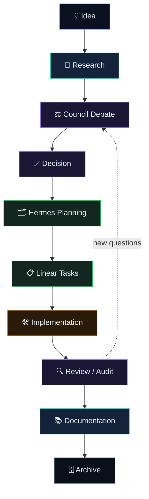
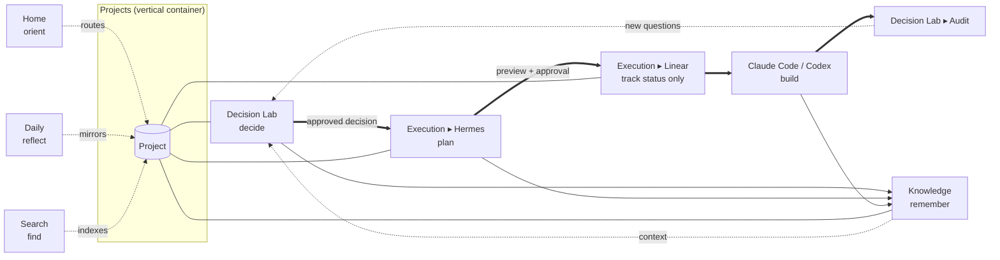

# Co Work — Product Development OS
## Information Architecture & Workflow Redesign

> **Design document only — nothing is implemented.** A first-principles redesign of the Co Work workspace as
> an **operating system for founders building products with AI**. Feel: Linear's execution discipline + Notion's
> memory + Cursor's AI-native flow — but organized around **workflows, not tools**.

---

## 0. The one law (north star)
**Every real task has exactly one obvious destination.** You should never wonder "where do I go?" — the answer
falls out of two questions you already know the answer to:

> **(1) Which project is this about?  (2) What stage of work is it in?**

That is the whole model:

- **Vertical axis = Projects** — the *container*. The one true home of every artifact.
- **Horizontal axis = Workflow lenses** — *Decide → Execute → Remember → Reflect*. The *stage* of the work.

`task = (project) × (stage) → exactly one cell → one destination.` No page has two jobs; no job lives in two pages.

**Principles**
1. Organize around **workflows** (verbs), not technologies (nouns).
2. **One responsibility per page.** If two pages solve the same problem, **merge them**.
3. **One source per artifact.** A decision, a plan, a doc exists in exactly one place; everywhere else *links* to it.
4. **Decisions flow down, never up.** Decide → Plan → Track → Build → Remember. Execution never re-opens strategy.
5. **Simplify before adding.** The win is fewer, sharper places — not more pages.

---

## 1. Information Architecture
Four conceptual layers, each a single verb. Everything in the workspace is one of these:

| Layer | Verb | The page(s) | Holds |
|---|---|---|---|
| **Container** | *contain* | **Projects** | every artifact, scoped to its project |
| **Decide** | *decide* | **Decision Lab** | debates → consensus → recorded decisions |
| **Execute** | *deliver* | **Execution** (Hermes ▸ Linear) | plans → tracked issues → releases |
| **Remember** | *remember* | **Knowledge** | the durable long-term memory |
| *(triage)* | *orient* | **Home** | "what now?" — a router, not a workroom |
| *(triage)* | *reflect* | **Daily** | the time-based log/standup |
| *(utility)* | *find* | **Search** | a global index over all of the above |
| *(utility)* | *configure* | **Settings** | providers, integrations, weights |

The first four are **lenses on a project**. When you're inside a project they scope to it; globally they aggregate.
**Home, Daily, Search** are *read/triage* surfaces over everything — you never create primary work there.

---

## 2. The ideal sidebar
Eight items. One verb each. Zero overlap.

```
●  Home            ← orient: "what should I do today?"
●  Projects        ← contain: the home of all work (expand → your projects)
─────────────────  (the four lenses below scope to the active project)
●  Decision Lab    ← decide: structured debate → consensus
●  Execution       ← deliver: Plan (Hermes) ▸ Track (Linear) ▸ Releases
●  Knowledge       ← remember: durable memory (architecture, research, lessons, specs)
●  Daily           ← reflect: today's progress, blockers, open questions
─────────────────
⌘K Search          ← find: everything, everywhere
⚙  Settings        ← configure: providers, integrations, voting weights
```

Why this shape:
- **Top = where you start** (Home), **then where work lives** (Projects), **then the lifecycle** (Decide → Execute → Remember), **then the daily mirror** (Daily). It reads top-to-bottom like the work actually flows.
- **Execution is one item, not two** — Hermes and Linear are stages of one verb (deliver), so they're tabs *inside* Execution, with a hard wall between them (Hermes plans; Linear only tracks).
- **Search and Settings sit apart** — utilities, not workflow stages.

---

## 3. Navigation
- **Two clicks to anything:** pick a **Project** (vertical), pick a **lens** (horizontal). The active project is shown as a persistent context chip in the top bar; switching projects re-scopes every lens.
- **Global vs scoped:** open a lens with **no project selected** → it aggregates across projects (e.g. Decision Lab shows *all* pending decisions; Execution shows *all* sprints). Select a project → it filters to that project.
- **⌘K command bar** is the real navigation: jump to a project, a decision, a doc, a Linear issue, or run an action ("New council debate", "Plan this decision in Hermes", "New doc"). Search and "go to" are the same surface.
- **Breadcrumbs** always read `Project ▸ Lens ▸ Artifact`, so you always know which cell you're in.
- **Cross-links, never copies:** a Linear issue links to its Hermes plan links to its Decision Lab session links to its project — one chain, traversable both ways, no duplication.

---

## 4. User journeys — every scenario has one destination
| You want to… | Go to | Why (and what it produces) |
|---|---|---|
| **Have a new startup idea** | **Home ▸ Capture** → it creates/links a **Project** (Inbox) | Capture is friction-free; the idea immediately gets a home project. Vet it next in the Lab. |
| **Get architecture** | **Decision Lab ▸ Architecture Mode** | Architecture is a *decision*, not a doc-dump. Output → recorded in the project, then published to **Knowledge ▸ Architecture**. |
| **Review Claude's work** | **Decision Lab ▸ Audit Mode** | Auditing an implementation is a structured critique (a debate over existing code), not a chat. |
| **Plan a sprint** | **Execution ▸ Plan (Hermes)** | Hermes owns milestones/epics/sprints from an approved decision. |
| **Create Linear issues** | **Execution ▸ Plan (Hermes)** → Linear Preview → approve | Issues are *generated* by Hermes and approved; you never hand-author strategy inside Linear. |
| **Write documentation** | **Knowledge ▸ Documents** (in the project) | Knowledge is the only home for durable writing. |
| **Research competitors** | **Project ▸ Research** (a Knowledge surface); debate it in **Decision Lab ▸ Research Debate** | Gathering = Knowledge/Research; *arguing the implications* = the Lab. |
| **Challenge an idea** | **Decision Lab ▸ Risk Analysis / "Grill"** | Pressure-testing is a decision-grade activity — the Lab's job. |
| **Prepare a release** | **Execution ▸ Releases** (with a **Lab** go/no-go if risky) | Release readiness is execution; the go/no-go is a quick decision. |
| **Review today's progress** | **Daily** | The only time-based mirror. |
| **Decide priorities** | **Decision Lab ▸ Product Review** (real reprioritization); **Home** for quick triage | Priority *decisions* are made in the Lab and recorded; Home only re-orders today. |
| **See project history** | **Project ▸ Timeline / Decision History** | Every project owns its own history. |
| **Find an old decision** | **⌘K Search** → or **Project ▸ Decision History** | Search indexes everything; the project owns the canonical record. |

**End-to-end journey (the spine):** *Home (capture idea) → Project created → Knowledge/Research → Decision Lab
(debate → consensus) → decision recorded in Project → Execution/Hermes (plan) → Linear Preview → approve →
Linear (track) → Claude Code/Codex (build) → Decision Lab/Audit (review) → Knowledge (document) → Project Archive.*

---

## 5. Responsibilities of every page
Each page answers four questions: **Why it exists · When to use it · What must never happen there · Relationships.**

### Home — *orient*
- **Why:** a 10-second answer to "what should I work on today?" A cockpit, not a workroom.
- **When:** the start of every session, and any time you feel lost.
- **Surfaces:** today's focus · what's **blocked** · **decisions waiting** for approval · what **changed since yesterday** · which **projects need attention** · a **Capture** box for raw ideas.
- **Never:** never do deep work here — no writing docs, no editing plans, no making decisions. Home *routes you* to the right cell; it never *is* the cell.
- **Relationships:** reads from Projects, Decision Lab (pending), Execution (blocked), Daily (deltas). Writes nothing except a captured idea (which becomes a Project inbox item).

### Projects — *contain*
- **Why:** the one true home of all work. Every artifact belongs to exactly one project.
- **When:** whenever you're working *on a specific thing*.
- **Auto-contains (as views, not copies):** Architecture · Roadmap · Decision History · Research · Documents · Sessions · Linear Links · Hermes Plans · Implementations · Releases · Context. (See §7.)
- **Never:** never duplicate a project artifact elsewhere; never let an artifact be "homeless." If it has no project, it's an idea in **Home/Capture**, not a floating page.
- **Relationships:** the container the four lenses scope into. It *aggregates* links; it doesn't re-author the artifacts (they live in their lens).

### Decision Lab — *decide* (the AI Council)
- **Why:** the single place **important decisions are made** through structured multi-agent debate → consensus.
- **When:** architecture reviews · product reviews · research debates · risk analysis · trade-off discussions · go/no-go.
- **Modes:** Architecture · Product · Research Debate · Risk/Challenge · Audit (review existing work) → each ends in a **recorded decision**.
- **Never:** **not a chat. Not a coding tool. Not a planner.** No casual Q&A, no implementation, no sprint-building. It debates and decides — full stop. It also never *executes* a decision.
- **Relationships:** consumes **Research** (Knowledge) + project **Context**; emits a **decision** → recorded in the project's Decision History → handed *down* to **Hermes**. Decisions flow one-way out of the Lab.

### Execution — *deliver* (Hermes ▸ Linear ▸ Releases)
Two stages behind one wall.
- **Plan (Hermes)** — *Why:* turn an **approved decision** into milestones · epics · issues · sprint plans · acceptance criteria · implementation prompts. *Never:* Hermes never *decides* (it implements the Lab's verdict) and never *tracks* status. *Relationships:* input = a Lab decision; output = a Hermes plan → a **Linear Preview**.
- **Track (Linear)** — *Why:* the operational source of truth for **execution status only**. *When:* to see/advance what's in flight. *Never:* **no strategy, no brainstorming, no research, no decisions** in Linear — only tracking. Issues arrive *from Hermes via approval*, never hand-written as strategy. *Relationships:* every issue links back to its Hermes plan → Lab session → project.
- **Releases** — *Why:* readiness + go/no-go assembly. *Relationships:* pulls from Linear status; a risky release triggers a quick **Lab** go/no-go.

### Knowledge — *remember*
- **Why:** the **long-term memory** of every project. If it's worth remembering, it lives here.
- **When:** to record or retrieve architecture · research · lessons learned · technical notes · design decisions · specifications · meeting notes.
- **Never:** never a workflow tool — no live debating, no task tracking, no "today" view. Knowledge is durable and read-mostly; transient state lives in Daily/Execution.
- **Relationships:** receives published outputs from the Lab (architecture, decisions) and Execution (specs, lessons); feeds **Context** into future Lab sessions. The "what did we decide/learn last time?" recall layer.

### Daily — *reflect*
- **Why:** the time-based mirror — today's progress, completed, pending, blocked, upcoming milestones, open questions.
- **When:** start-of-day plan, end-of-day review, weekly retro.
- **Never:** never the home of durable artifacts — Daily *summarizes*; it doesn't *store*. Don't make decisions here (that's the Lab) or author docs (that's Knowledge).
- **Relationships:** a generated digest over Execution (status), Decision Lab (pending), Knowledge (new notes), and the project timeline. Open questions raised here graduate to the Lab.

### Search — *find* · Settings — *configure*
- **Search:** one ⌘K index over Projects · Decisions · Research · Documents · Linear Issues · Hermes Plans · Sessions · Architecture — **everything**. It finds and navigates; it never edits.
- **Settings:** providers (Claude Code/Codex/AntiGravity + future), integrations (Linear/Hermes), voting weights, project defaults. Config only.

---

## 6. The Decision Flow (with owners)
One lifecycle, one owner per step. Work only ever moves **down**.



| Step | Owner (page) | Owner (who/agent) | Done = |
|---|---|---|---|
| Idea | Home ▸ Capture | Founder | a Project inbox item exists |
| Research | Knowledge ▸ Research | Founder + research agents | findings gathered + cited |
| Council Debate | Decision Lab | The Council (multi-agent) | consensus + retained dissent |
| Decision | Decision Lab → Project | Founder approves | recorded in Decision History |
| Hermes Planning | Execution ▸ Plan | Hermes | milestones/epics/issues drafted |
| Linear Tasks | Execution ▸ Track | Founder approves → Linear | issues created, traced to session |
| Implementation | (build) | Claude Code / Codex | merged behind review |
| Review / Audit | Decision Lab ▸ Audit / Daily | The Council + Founder | pass, or new questions loop back |
| Documentation | Knowledge | Founder + agents | durable note published |
| Archive | Project | Founder | project state frozen + searchable |

The only loop allowed: **Review → Council** (new questions re-enter the Lab). Everything else is one-directional.

---

## 7. Project structure
A project is a workspace-within-the-workspace. It **auto-contains** these views the moment it's created — they are
**lenses into the project, not separate pages**, so nothing is ever duplicated:

| Sub-area | What it is | Lives in (lens) | Single source |
|---|---|---|---|
| **Context** | the always-on brief: north star, constraints, guardrails | Project header | the project itself |
| **Architecture** | system map, modules, contracts | Knowledge | one architecture doc |
| **Roadmap** | milestones + status over time | Execution | one roadmap |
| **Decision History** | every recorded decision (from the Lab) | Decision Lab | the session log |
| **Research** | gathered findings, competitor maps, references | Knowledge | research folder |
| **Documents** | specs, notes, guides | Knowledge | docs folder |
| **Sessions** | every council debate run for this project | Decision Lab | session store |
| **Linear Links** | the project's tracked issues (read-through) | Execution ▸ Track | Linear |
| **Hermes Plans** | the execution plans generated for this project | Execution ▸ Plan | Hermes store |
| **Implementations** | what was actually built (PRs/commits/branches) | Execution | VCS links |
| **Releases** | shipped versions + readiness | Execution ▸ Releases | release log |

**The single-source rule:** each artifact type has exactly **one** authoring home (its lens). The Project page only
**aggregates links** to them. A decision is authored in the Lab and *appears* under the project's Decision History;
it is never copied. Open any project and you see the whole picture; open a lens and you edit one slice.

**Project lifecycle:** `Inbox (idea) → Active → Maintenance → Archived`. Archiving freezes the project (read-only,
fully searchable) — it doesn't delete; it becomes Knowledge.

---

## 8. Relationships between modules
The dependency rule is strict and one-directional. **Decisions flow down; memory flows in; nothing flows up.**



**Hard rules encoded above**
- **Lab → Hermes → Linear is one-way.** Linear cannot create strategy; Hermes cannot make decisions; the Lab cannot execute.
- **Everything worth keeping → Knowledge**, and Knowledge feeds **Context** back into future debates (the only "up" arrow is *memory*, not *control*).
- **Home / Daily / Search are read-only lenses** over the container — they never originate artifacts.
- **The Project is the join key** — every artifact carries a `projectId`; that's what makes "(project) × (stage)" resolve to one cell.

---

## 9. Suggested simplifications (merge the overlap)
The current workspace grew tool-first, so several pages/docs solve the *same* problem. Collapse them:

| Today (overlapping) | Merge into | Why |
|---|---|---|
| `/ops` · `/command-center` · neural-map view · module-status-board | **Home** (triage) + **Project** (per-project status) + **Knowledge ▸ Architecture** (the map) | Three "dashboards" answer one question ("what's the state?"). Split by *audience*: Home = today, Project = this project, Knowledge = the durable map. |
| `daily-workflow.md` · `daily-routine.md` · `daily-design-loop.md` · `continuous-improvement-loop.md` · `workflow-registry.md` | **Daily** (one page) + a single **"How we work"** note in Knowledge | Five "how/when to work" docs = one Daily surface + one canonical process note. |
| `decision-log.md` · `decisions.md` · `founder-decision-queue.md` | **Decision Lab → Decision History** (one record) | One decision ledger per project; "queue" = the Lab's *pending* filter, not a separate file. |
| `system-map.md` · `module-registry.md` · `rangeclarity-deep-modules.md` · `neural-map.json` | **Knowledge ▸ Architecture** (one living map, multiple views) | One architecture source; the neural map is a *view* of it, not a parallel truth. |
| `command-center.md` · `project-memory.md` · `rc-ops-console.md` | **Project ▸ Context** + **Knowledge** | "Memory" and "context" belong to the project + Knowledge, not standalone ops pages. |
| `kanban.md` + ad-hoc Linear plans | **Execution** (Hermes plans → Linear) | One execution surface; kanban is a *view* of Linear status. |
| Scattered competitor/marketing docs | **Project ▸ Research / Knowledge** + a **Marketing** project | Marketing is a project like any other; its research lives in Knowledge. |

**Net effect:** ~20 overlapping pages/docs → **8 sidebar destinations + per-project lenses**. Fewer places, each sharper.

---

## 10. Features to remove (or demote to a view)
- ❌ **Tool-shaped pages** (a page named after a technology rather than a job). If a page's name is a tool, it's a smell — re-home it under a workflow lens.
- ❌ **Duplicate dashboards.** Keep exactly one "state" surface per audience (Home / Project / Architecture); delete the rest.
- ❌ **Multiple "daily/loop/routine" docs.** One **Daily** page; one canonical process note.
- ❌ **Standalone decision logs.** Decisions live only in the Lab → Decision History.
- ❌ **Free-floating documents** with no project. Everything attaches to a project (or sits in Home/Capture until it does).
- ❌ **Strategy/brainstorm inside Linear.** Linear is status only — strip any planning/notes fields used as scratchpads.
- ❌ **Chat-as-workspace.** The Lab is not a chat; coding is not in the Lab. Remove the "ask the AI anything here" surfaces that blur responsibilities.
- ❌ **Manual issue authoring** as the primary path. Issues are *generated* by Hermes from a decision and approved — hand-authoring is the exception, not the workflow.
- ⚠️ **Demote, don't delete:** neural map, module registry, kanban → keep them as **views** inside Knowledge/Execution, not as top-level pages.

---

## 11. Future roadmap (phased)
**Phase 1 — Re-home (no new features).** Stand up the 8-item sidebar. Map every existing page/doc into exactly one
destination (the §9 table). Establish the **Project** as the join key. Outcome: nothing new, but everything has one home.

**Phase 2 — The lens model.** Make Decision Lab / Execution / Knowledge / Daily scope to the active project; aggregate
when no project is selected. Wire **⌘K Search** across all artifact types. Outcome: "(project) × (stage)" navigation works.

**Phase 3 — The spine flows.** Connect the Decision Flow end-to-end: Lab decision → one click "Plan in Hermes" →
Linear Preview → approve → tracked, with full back-links. Daily auto-digests it. Outcome: a decision walks to execution
without copy-paste.

**Phase 4 — Memory & recall.** Knowledge becomes active: "what did we decide about X?" recall, project Context
auto-assembled from history, lessons surfaced into new debates. Outcome: the OS remembers.

**Phase 5 — Multi-project portfolio.** Home becomes a portfolio cockpit (which projects need attention, cross-project
blockers, weekly founder review). Outcome: run several products from one calm surface.

**Phase 6 — Premium polish.** Keyboard-first everywhere, instant transitions, a calm dark system, zero dead-ends.
Outcome: it *feels* like an operating system for founders building with AI — Linear's rigor, Notion's memory, Cursor's
AI flow, with one law: **every task has one obvious destination.**

---

### Appendix — the test for any future page
Before adding anything, it must pass all five:
1. **One verb.** Does it do exactly one job (orient / decide / deliver / remember / reflect / find / configure)?
2. **No overlap.** Does any existing page already do this? If yes — merge, don't add.
3. **One source.** Will its artifacts have exactly one authoring home?
4. **A scenario.** Name the real task that lands here and *only* here.
5. **The law.** After adding it, is there still exactly one obvious destination for every task?

If it fails any test, it's a view — not a page.
